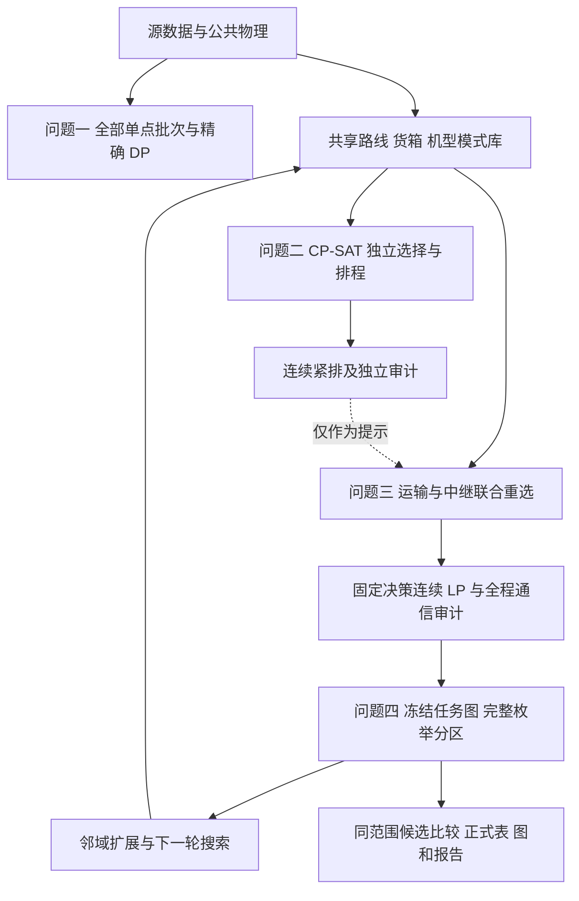

# 四问流程、算法与题目审查

审查日期：2026-09-26。依据 `docs/山区洪涝灾害下无人机运输与通信协同优化.md` 的四问、附录 2/3，以及五份原始 Excel、30 m DEM。原始输入未修改。

本文对应 `final_code/` 的正式入口。正式结果按 `outputs/q1/`、`outputs/q2/`、`outputs/q3/`、`outputs/q4/` 分类。模板字段表在各问 `tables/`，图在 `figures/`；来源记录保存在 `outputs/provenance/`，检查证据在 `outputs/checks/`。历史候选和重复文件已清理。

## 1. 审查结论与本次修正

“统一模式库—第二问独立优化—第三问联合重选—第四问冻结分区—反馈扩展”的结构可以用于本题。第二、三问的组批、路线和排程必须共同选择；第三问不能简单继承第二问运输方案后只补中继。当前正式入口满足这一点。

原整理版本仍有以下问题，本次已修复：

| 项目 | 原问题或不足 | 修正 |
| --- | --- | --- |
| 第四问中继归属 | 只合并同运输架次的服务区，允许同一中继任务在多个组各执行一份 | 按运输任务和中继保障关系取传递闭包；每个冻结架次只归属一个组，禁止复制、拆分和改时刻 |
| 候选比较范围 | 独立 Q3 的四维分数与预留分区的八维分数可能直接比较 | 同批比较必须具有相同 `q3_partition_groups`、源数据和冻结分区政策，核对 manifest 与实际求解范围 |
| 发布时的冻结检查 | 仅有可行标记不足以证明 Q4 对应当前 Q3 文件 | 检查冻结政策及 `screening.json`、任务、通信、资源文件的 SHA-256；拒绝过期分区 |
| 第二问独立入口 | 回代了物理时间，但没有使用统一入口已有的连续紧排 | 两个入口均按固定无人机、电池先后顺序求最早开始时刻 |
| 遗留第三问入口 | `transport_relay.py` 曾可直接运行固定 Q2 后补中继的对照算法 | 删除旧串行求解器与 `timeline.py`；只保留 `trajectory.py` 中正式联合算法所需的轨迹、审计和导出函数 |
| 第三问独立入口 | 初始位置库找不到联合解时直接退出 | 扩展位置与高度后重试；限时无解仍明确报告，不能解释为原题无解 |
| 第三问连续时间 | 原方案仍可能含整秒保守取整造成的等待 | 加入固定离散决策、资源顺序与充电分支下的连续线性规划，随后重新执行通信和资源审计 |
| 保存方案复核 | 读取结果时可能忽略额外的逐箱记录、部分冗余导出字段 | 检查货箱唯一性、未知架次、箱数，重建物理轨迹并核对汇总指标、中继资源导出 |
| 汇总表和图 | Q1 不可行说明过强；Q4 目标写成 Q2/Q3 目标；第三问范围和来源硬编码；权衡图漏新方案或错读分区缺口字段 | 改为真实运行来源与范围，区分各问目标，使用实际比较候选绘图；不可分区情形可汇总 |

第四问修正依据是题目同时要求“运输与中继任务安排及通信保障关系不变”“各任务组仅承担本组服务区对应的运输与通信保障任务”“各类资源不得跨组调配”。如果复制一个中继架次，任务数量和保障映射已经变化；这可以作为另一个放宽场景研究，但不作为本次正式第四问口径。

审查前选中的第四问方案碰巧没有实际复制中继，因此其最小缺口没有变化；修正改变了合法候选集合及最优性证明的范围，不能因此省略。

## 2. 公共数据、单位与物理口径

- O01 为唯一基地，15 个服务区，80 个不可拆货箱。箱号、机型、实体无人机、电池分别保留自己的标识。
- DEM 的坐标系为 EPSG:4326；经纬度用度，高度/距离用 m，质量 kg，体积 m³，时间 s，能量 kWh。
- 地形遍历沿经纬度线性插值的水平路径进行，计入像元边界和角点接触；遇到越界或 NoData 不作安全假设。距离用平均地球半径 6371008.8 m 的大圆距离。这是本地直线距离的地理近似。
- O01 作业高度取表中地面海拔；服务区取表中地面海拔加 30 m；运输巡航海拔取路径触及的全部 DEM 像元最高值加 50 m。多点航线每次投送后重新爬升，逐段扣减剩余货载。
- 表中节点海拔与 DEM 各有用途：前者定义作业端点，后者检查航路与 LOS；没有为了让方案可行而改写源高程。

载荷—航程关系为

\[
L_g(q)=L_g^0-(L_g^0-L_g^F)(q/Q_g)^{3/2}.
\]

程序明确采用以下能量标定：

\[
E^{hor}_{gij}(q)=E_g^{use}\frac{d_{ij}}{L_g(q)},\qquad
E^{up}_{gij}(q)=\frac{(m_g^{body}+m_g^{battery}+q)g h_{ij}^+}{3.6\times10^6\eta_g}.
\]

题面没有完整展开水平能耗函数，因此第一式是应在论文中披露的建模假设；爬升效率按无量纲推进效率解释。下降效率为零时不另加下降能耗。时间按爬升、巡航、下降分别除以对应速度，再加准备、逐箱装载和服务交接时间。返航必须满足 `E ≤ (1−ρ)E_use`，正式 Q2/Q3 的 `ρ=0.2` 与当前三种机型附件值一致。

运输电池和中继能源组件初始充满，使用后按题目两阶段充电至 100% 才可复用；机型间不可混用。同型充电参数一致时可用累计容量约束，再精确分配实体编号。附件未限制充电工位，因此不同组件可以并行充电。

中继采用巡航功率、起飞总质量爬升能耗，以及悬停功率与通信附加功率；**建链阶段也消耗悬停与通信能量**。若悬停海拔高于路径地形最高值加 50 m，程序取 `max(最高地形+50, 起点海拔, 终点海拔)` 为航段中间海拔，避免出现“负爬升/负下降”，并完整计入升至悬停高度的能量。这是把附录净空规则扩展到高空悬停端点的明确约定。

未另外加入风场、禁飞区、避碰、气动悬停运输能耗、有限中继接入容量或充电工位等附件未给出的限制；若用于现实调度，需要另补数据，不能把当前数值外推为现实飞行保证。

## 3. 问题一：全部单点批次枚举与精确集合划分

入口：`problem1/solver.py`。

### 流程

1. 计算 O01—Si—O01 的去程载货、返程空载地形、时间和能耗。
2. 利用往返能耗随载荷单调不减，在 `[0,Q_g]` 二分最大安全质量载荷；单独记录零载荷也无法往返的情形。
3. 对每个服务区枚举其所有非空货箱子集，与全部三种机型组合。
4. 筛除质量、体积和能量不合格的批次。
5. 用位掩码集合划分动态规划，使该服务区每个箱子恰好覆盖一次；每次扩展包含最小未覆盖箱子的批次以去除重复。
6. 分别求三种字典序：`架次→能耗→累计作业时间`、`能耗→架次→时间`、`时间→架次→能耗`。
7. 合并各服务区方案，再改变安全余量或水平能耗率进行敏感性分析。

若 `F(M)` 表示已覆盖集合 M 的最佳指标向量，则转移为

\[
F(M\cup B)=\min_{lex}\{F(M)+c(B,g):B\cap M=\varnothing\}.
\]

这里累计作业时间是各架次准备、装载、飞行、交接时间之和，**不是**多机并行调度完成时间。问题一不加入实体机、电池调度，也不施加问题二才要求的医疗/首批时限。

### 最优性与输出

每个服务区的全部可行批次均已枚举；服务区之间没有资源耦合且指标可加，因此给定能耗模型和字典序下的组合解是全局最优。三个顺序仅给出代表性权衡解，不是完整 Pareto 前沿。

基准架次优先结果：18 架次，59.240257802 kWh，累计作业 32798.500032 s。能耗优先允许 19 架次，能耗 59.142212517 kWh，体现多一架次换取少量能耗下降。

默认共有九个场景：基准 20%，余量 10%、15%、25%、30%、40%、50%，以及水平能耗率 0.8、1.2 倍。两类敏感性单独变化，不是笛卡尔积。40% 时 S004、S008 不可行；50% 时 S002、S003、S004、S008、S012 不可行。“全任务不可行”不等于所有服务区都不可行。

`safe_payloads.csv` 给出安全载荷，`batches*.csv` 给出组批/航段明细，`sensitivity_summary.csv` 给出敏感性；正式表为 `problem1_submission.xlsx`。本次完整重新计算的 JSON 与原结果逐项一致。

## 4. 问题二：路线模式、CP-SAT 联合选择与连续回代

入口：`problem2/run.py`；统一入口：`run_all.py`。

### 共享模式库

一个模式 p 固定：货箱集合、访问顺序、机型，以及由公共物理计算得到的持续时间、逐箱交付偏移、能耗、返航 SOC、充电时间。实体编号和开始时刻尚未固定。

初始库来自三种逐区精确组批、构造式组批、跨区合并和全部单箱模式；每种可行机型变体都保留。后续加入拆分、合并、单箱转移及路线排列邻域。只去重和排除物理/最早硬时限不可行模式，不以“运输能耗更低”作为跨问题的简单支配剪枝，因为通信覆盖、时限、资源占用可能改变优劣。

`--complete-single-site` 可补齐单服务区的全部箱子子集，但仍不覆盖全部多点路线，也不能因此声明第二问全局最优。邻域最多三站及每轮接纳上限是搜索限制，不是题目限制。

### 主模型

模式选择变量 `x_p∈{0,1}`，开始时刻 `s_p` 为整数秒。

- 每箱恰好一次：`Σ_{p包含b} x_p=1`。
- 每个选中模式创建无人机占用区间 `[s_p,s_p+ceil(T_p))`。
- 对应电池区间延长至 `ceil(T_p)+ceil(t_charge,p)`。
- 同机型分别施加机体和电池累计容量约束；这允许同型共享电池在不同实体无人机间周转。
- 医疗期望时间及标注首批货箱的截止时间均为硬约束；同时属于两类时取更早约束。其他期望时间产生软迟到惩罚。
- `Cmax ≥ s_p+ceil(T_p)`；完成时间以最后运输机返航为准，不等待最后一次充电结束。

目标公开采用 `完成时间→加权迟到→运输能耗→架次数`。这是一种允许的建模优先顺序，并非题目唯一指定的顺序。每阶段限时求解，下一阶段约束上一阶段目标不超过已有上界；若前一阶段未证明最优，只能称为按上界逐级改善，不能称为精确字典序最优。

### 连续回代和检查

对选中可选区间进行区间图着色，分配具体无人机与电池编号。随后固定这两类资源各自的先后顺序，求最早连续开始时刻，消除保守取整留下的空隙。时间只提前，原来通过的硬截止时间不会因此变坏。

逐架次从源箱数据和 DEM 重新计算航段载荷、时间、能耗、SOC、交付时刻，并检查资源不重叠、充电至满、80 箱唯一覆盖及最小巡航净空。这一步保证可行性，不证明遗漏路线或其他资源顺序不存在更优方案。

输出包括路线图、架次与逐箱表、无人机/电池甘特图、充电与航段审计、时限指标及 `problem2_submission.xlsx`。

## 5. 问题三：运输与中继共同重选及连续通信认证

入口：`problem3/run.py`；主优化仍是 `problem2/master.py`。

### 通信预处理

从运输模式构建包含爬升、巡航、下降、交接和返航的分段线性三维轨迹。固定网关使用附件的天线离地高度；双向门限取两个方向预算的较小值。

\[
L_{path}=32.45+20\log_{10} f_{MHz}+20\log_{10}D_{km}+L_{obs}b.
\]

允许直连，或经**一架**中继构成接入与回传两段链路；两段同一时刻都必须可用，不允许中继间多跳。中继位置限定在有效 DEM 内，离地高度不超过附件上限。

候选位置来自服务区和已有地理参考点；扩展搜索加入经纬偏移及多个高度。这是有限选址近似。对于每个运输模式，不能证明整个区间直连的时段形成中继需求；一个需求只列入能证明整个时段接入、回传成立的位置。几何相同的模式可共享通信缓存，但缓存必须匹配原始数据及几何算法指纹。

### 联合 CP-SAT

第三问重新选择全部运输模式、时间与实体资源，第二问只提供提示。每个中继槽位同时决定是否使用、位置/高度、服务开始和结束，以及它保障哪些运输需求。

约束覆盖准备、飞出、建链、服务、返航、机体周转、能源组件充电；联合完成时间包含最后中继机返航。运输与中继能量相加，架次数也包含两类。中继返航 SOC 与实体库存单独校验。

`--partition-groups 0` / `--q3-partition-groups 0` 是独立第三问。2 或 3 则额外要求冻结任务图能分成相应组数，属于面向第四问的附加可行域限制。当前正式结果按独立第三问范围选择，同时其冻结结果可以完成两种分区。两个范围必须分开比较。

### 连续认证而非离散抽检

`physics.py` 遍历 LOS 经过的像元；对移动链路覆盖整段扫掠 LOS 面，用包围区间的距离上界、LOS 高度下界和触及像元高程上界证明整段链路成立。不能证明时递归细分；即使中点链路可用，也不能直接认证整个区间。

最终最小细分 0.25 s 限制的是证书搜索，不是忽略小于 0.25 s 的中断。未获证明的区间仍拒绝。`uncertified_interval_s` 是未认证时长，旧兼容字段 `communication_outage_s` 是实际中断时长的上界；只有其为零并且整个轨迹覆盖完毕才能判连续可行。

执行策略是任意时刻直连可用就直连，否则使用该区间指定的一架可用中继。审计表“中继”表示需要保留整段中继保障的区间，其中部分瞬间也可能直连可用；其时长是保障预留时长，不是逐瞬间无线状态切换时长。采用该保守预留，不会要求两架中继同时向同一运输机提供服务。

### 本次加入的连续时间优化

`problem3/refine.py` 用 GLOP 求固定运输路线、机型、悬停位置、需求归属及资源顺序下的线性规划：运输开始、中继服务起止可连续变化；服务窗须包含所有已认证的相对需求窗，资源链按先后关系衔接。

中继能量随服务窗长度线性变化。两阶段充电是分段线性函数，程序固定原方案的充电分支，并限制能量不跨出该分支，因此当前子问题是 LP；没有把分段关系错误地当成任意全域线性式。资源衔接留 1 微秒数值余量。顺次最小化联合完成时间、加权迟到、中继能耗，运输能耗与总架次数在此子问题固定。

该 LP 的最优性仅适用于上述固定决策和分支。候选必须再次通过运输、中继、通信审计，且真实指标优于原候选才接纳。不能像第二问那样单独提前运输时刻而保持中继窗不动。

## 6. 问题四：冻结任务图的完整分区与资源核算

入口：`problem4/solver.py`。

### 原子单元和枚举

1. 冻结第三问逐箱、运输、中继、通信保障文件及其哈希。
2. 用并查集合并同运输架次涉及的服务区。
3. 对每个中继架次，把其保障的全部运输架次涉及的服务区再次合并，取传递闭包。
4. 每个连通分量都是不可拆分单元。按无标签非空集合划分分别完整枚举 K=2、3。
5. 少于 K 个原子单元时，严格冻结下该 K 不可行。必须回到第三问重新生成候选，不能在第四问改排程或复制中继掩盖不可行。

m 个单元有 `S(m,K)` 个候选，S 为第二类 Stirling 数。当前选中 Q3 有 5 个单元，候选数分别为 15、25。原子数为 13 时 `S(13,3)=261625`；不能把这个数误写成 15 个单元的分区数。

### 资源数、库存和目标

每组独立执行所有冻结任务。同型机体/能源资源视为可互换，可在组内重新分配编号；任务时间和通信任务本身不变。某一类最小配置等于其占用区间最大重叠数，区间采用左闭右开，结束和下一任务开始重合时允许复用。

| 资源 | 占用终点 |
| --- | --- |
| 运输机体 | 返航 O01 |
| 运输共享电池 | 返航后按两阶段模型充满 |
| 中继机体 | 返航后完成机体周转 |
| 中继能源组件 | 返航后充满 |

每类总需求是各组峰值之和；未分区峰值、分区增加量、库存缺口和库存余量分别计算。总库存只有一份，不能对每组重复核算整份库存。“分区可行”与“库存足够”是不同判断；题目允许并要求说明超库存方案的缺口。

目标按 `总库存缺口→各类资源件数之和→最大工作量 CV` 字典序选取。CV 取运输飞行作业时间、中继服务时间、运输架次、箱数四项的最大值；另输出质量、能耗等统计。资源等权计件是一项评价假设，不代表采购成本；零均值的 CV 没有定义，全部为零的维度不影响最大值。

完整枚举证明的是**该冻结第三问、该目标下**的分区全局最优。不能把它扩展成四问原题全局最优。资源优先可能得到明显不均衡的分区；若希望优先均衡，需要公开更改目标权重或优先级并重新计算。

## 7. 反馈、最优性边界与进一步改进



`run_all.py` 在多轮中扩大共同库；联动范围还用上一轮三组结果作为末级“少跨旧分区”的偏好。这不是把旧分区永久锁死，下一轮第三问仍可重选。独立第三问不接收分区偏好。第四问自身始终只读冻结方案。

当前无法声称第二、三问或四问联动全局最优，原因包括：有限箱子组合/路线排列，有限悬停位置和高度，整秒保守调度、微 kWh 能量网格，有限任务槽位和时间域，通信充分条件的保守性，以及 CP-SAT 的时间限制。受限模型的下界**不能直接当成原始连续问题的全局下界**，更不能据它给出原题全局最优间隙。

若继续追求更强结果，优先方向是：

1. 在已有好方案周围增加跨区换箱、交换两箱、更多访问序的列；按临界资源和时限引导扩展，避免固定字典顺序总偏向少数服务区。
2. 对中继位置/高度做多尺度局部细化，允许长保障需求被多个连续服务窗覆盖；每次仍须重新做连续证书，不能只看采样点。
3. 搜索不同无人机/电池顺序、充电分支；当前 LP 只优化固定顺序和分支，未穷尽这些离散选择。
4. 在明确的联动目标下比较中继任务拆分与资源缺口之间的权衡。拆分必须发生在第三问重优化阶段；第四问冻结后不允许拆分。
5. 真正证明全局最优需完备的路线/箱集合定价或全枚举、对连续选址域有效的上下界，以及可验证的分支定界终止证据。现有启发式扩列不具有这样的证明。

## 8. 验证和复现

推荐 Python 3.10+，依赖见 `requirements.txt`。本次主流程使用 Python 3.10.12、OR-Tools 9.15.6755、NumPy 2.2.6、Rasterio 1.4.4、OpenPyXL 3.1.5、Matplotlib 3.10.9。当前仅保留正式 CP-SAT/GLOP 路径，已移除旧对照算法及 SciPy 依赖。

从仓库根目录执行，新搜索和审计目录须为空：

```bash
# 四问独立入口
.venv/bin/python -m final_code.problem1.solver --output /tmp/math-race-q1
.venv/bin/python -m final_code.problem2.run --output /tmp/math-race-q2 --time-limit 240
.venv/bin/python -m final_code.problem3.run --output /tmp/math-race-q3 --time-limit 240
.venv/bin/python -m final_code.problem4.solver --input outputs/q3 --output /tmp/math-race-q4

# 统一库：独立 Q3 范围；设为 3 才启用预留分区及分区反馈
.venv/bin/python -m final_code.run_all --output /tmp/math-race-run \
  --rounds 2 --time-limit 240 --expanded-locations --q3-partition-groups 0

# 审核保存方案：从源数据重算，不仅检查旧 feasible 标记
.venv/bin/python -m final_code.review --source outputs \
  --output /tmp/math-race-audit

# 回归测试
.venv/bin/python -m unittest discover -s tests -v

# 提交表、图、压缩包和汇总表
.venv/bin/python -m final_code.publish --source outputs --output outputs
.venv/bin/python -m final_code.summary_workbook --output outputs/四问指标汇总.xlsx
```

第一问检查全部敏感性与模型正确性；第二问测试物理量被篡改、硬时限/资源及连续回代；第三问测试像元角点障碍、采样之间的遮挡、悬停高度与建链能耗、联合重选及连续优化；第四问测试传递闭包、跨组中继拒绝、完整枚举、半开区间、充电与库存口径；发布与比较测试范围混用、旧政策及冻结记录变更。

数值结果和本次搜索比较见 [审查结果](../outputs/REPORT.md)，完整复核数据见 `outputs/checks/audit.json`。随机种子、时间限制、模式库、选址表、各阶段状态和来源指纹随运行保存。多线程 CP-SAT 限时搜索可能产生不同候选；保存的已选方案可以按上述复核入口独立验证。

## 9. 整理后的交付结构

`结果提交汇总.xlsx` 保留原模板的六张表及列顺序。由于模板没有第三问专用的运输表，另补充 `Q3_运输架次` 和 `Q3_逐箱交付`，承载第三问重新选择的运输方案。第二问原表始终保留独立第二问的结果。四问各自工作簿只保留相关工作表，第三问单独文件的运输部分沿用模板的 Q2 字段名；各问 `tables/` 则以所属问号命名。

`publish.py` 只分类、绘图和填表，不再次优化；`submission.py` 从原始模板读取并核对表头，防止改变提交口径。`summary_workbook.py` 另外生成 26 张表的指标汇总。全部源码和测试只打包一次为 `outputs/程序.zip`。

精简时删除了旧问题三串行求解器、重复充电函数、旧采样审计、已不使用的运输构造式独立入口、一次性的保存方案改进脚本、重复模型说明和依赖清单。正式模式生成所需的构造式热启动仍保留；连续认证、物理计算和检验测试均保留。仓库原有 `pic/`、`analysis/` 辅助目录未纳入正式运行流程，仍予保留。
